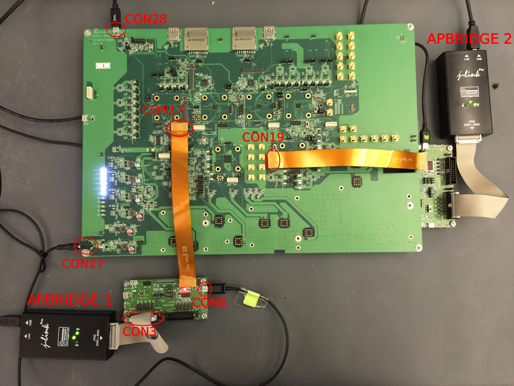

#### Required Hardware

Congratulations!  You've received Version 1 Rev B of the Project Ara development hardware, a "Big Development Board" as we like to call it.  We typically use the shorthand "BDB 1 Rev B" or "BDB1B".  Your kit should also contain:

* Two Debug Adapter Boards Rev B
* Two Debug Flat Printed Circuit (FPC) cables Rev B
* A 12V power source

You'll also want to have:

* 2 [J-Link Pro JTAG programmers](http://www.segger.com/jlink-pro.html) with USB cable and 20-pin JTAG cable, so that you'll be able to program and control Application Processor (AP) Bridge 1 and Bridge 2 on your BDB1B.
* 1 micro USB to USB A cable, to connect to your Application Processor (AP).  Don't connect the USB A end of the cable to your AP until instructed during the bring up procedure.
* 2 micro USB to USB A cables, to provide access to the AP Bridge 1, and AP Bridge 2 consoles.

As with any development board, you'll ideally want to work in an ESD-safe environment that provides a controlled path for dissipating static buildup. 

#### One-Time Setup

Now what? Let's start with some setup.

Please verify that your Debug Adapter Boards are configured properly for JTAG use:

[[Debug board setup for JTAG|Debug-Adapter-Board-Rev-B-Setup-For-JTAG]]

Before applying power, you'll want to cable everything together:
* Attach the micro USB end of a USB cable to the connector on the BDB1B labeled CON 28 (USB to APB1 HSIC).  Leave the other end of this cable unconnected, until instructioned to attach it to your AP:  

* Attach one end of a Debug FPC cable (the end labeled **BDB**) to the BDB1B connector labeled CON17 (APB1 SPI/JTAG/TRACE) and the other end (labeled Debug Board) to the mating connector on one of the Debug Adapter Boards.
* Attach one end of a Debug FPC cable (the end labeled **BDB**) to the BDB1B connector labeled CON19 (APB2 SPI/JTAG/TRACE) and the other end (labeled Debug Board) to the mating connector on the other Debug Adapter Board.
* Attach the micro USB end of a USB cable to the connector labeled CON6 (UART) on each Debug Adapter Board.  These cables will provide access to the consoles for APBridge 1 and APBridge 2.
* Connect a JTAG debugger to the 20-pin connector labeled CON3 (Bridge) on the each Debug Adapter Board. **Note**: Please visually verify that you are plugging into CON3, not CON2.
* Connect each JTAG debugger to the build machine via a direct USB connection.  The J-Link Pro JTAG Debugger also supports connections via Ethernet, but the present document assumes USB.

If the 2 USB console cables are connected to a PC, the APBridge 1 and APBridge 2 consoles may be accessed (when code is running) via a terminal emulator such as minicom: 115200, 8N1, no hardware flow control.

You may apply power at this point by attaching the provided 12V Adapter to CON27 (DC Jack 12V) on the BDB1B.

Here's a bird's-eye view of the overall setup:

#### Next Steps

The next step in bringing up your development board is to finish the [Development Machine Setup](Development-Machine-Setup).

After that, you can proceed to the [Firmware Build](Firmware-Build).
