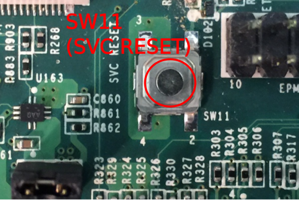
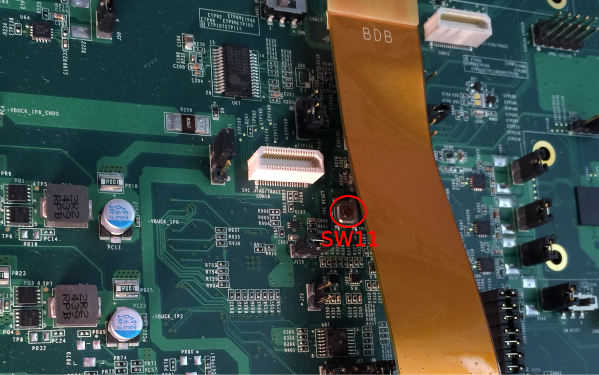
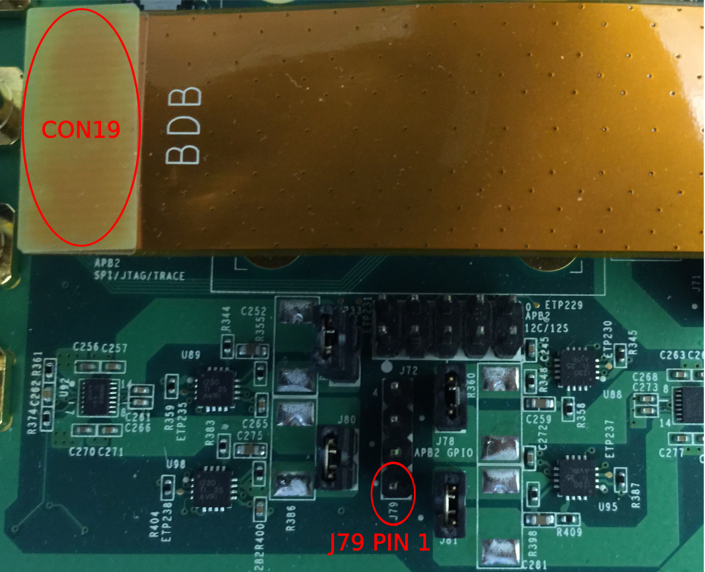

It's time for all your hard work to pay off, in that you now have the opportunity to experience the exciting functionality built into the example firmware that you've just [Loaded into the APBridges](Loading-Example-Firmware-into-the-APBridges)!

**Note:** Make sure to successfully load the firmware into both bridges before proceeding here.

You need to prepare an Application Processor (AP), and build the [Greybus kernel modules](https://github.com/projectara/greybus) (greybus, gb-phy, and gb-es1) for the Linux kernel running on that AP. This procedure is not documented here, but it will be familiar to Linux kernel programmers; see the README in the greybus repository for more details.

**DO NOT CONNECT THE BDB1B AND AP VIA USB UNTIL INSTRUCTED TO BELOW.**

Ready to continue?  OK!

#### Bringing up the AP to APBridge 1 Connection

The following sequence represents the present "best practice" for bringing up a connection from the AP to APBridge 1:

1. Have everything connected (JTAG to APBridge 1, JTAG to APBridge 2) **except** the AP to the BDB1B
2. Reboot the AP, or if the AP's console is nonresponsive, reset the AP to force a reboot.
3. Load the greybus, gb-phy, gb-es1 modules (in that order) into the AP's kernel.

    ```insmod greybus.ko```

    ```insmod gb-phy.ko```

    ```insmod gb-es1.ko```
 
    **Note**: If you've arrived at this wiki page, have satisfied the prerequisites, and are running through this sequence for the first time, you may skip to step 9 since the BDB1B is in a known state with firmware already running on both APBridges.

4. Reset the Supervisory Controller (SVC) by pressing and releasing SW11 (also labeled SVC Reset) on the BDB1B.  This also resets the APBridges:

Please note that SW11 may be partially covered or obscured by the FPC cable running from the BDB1B to your APBridge 1 Debug Adapter Board:

5. If APBridge 2 is presently running (perhaps because you’ve iterated through this sequence already), stop it with a CTRL-C in the window where you started the associated GDB, to return to a (gdb) prompt.
6. Load and run the bdb/apb2 firmware on APBridge 2, as documented in [[Loading-Example-Firmware-into-the-APBridges]].
7. If APBridge 1 is presently running (perhaps because you’ve iterated through this sequence already), stop it with a CTRL-C in the window where you started the associated GDB, to return to a (gdb) prompt.
8. Load and run the bdb/apb1 firmware on APBridge 1, as documented in [[Loading-Example-Firmware-into-the-APBridges]].
9. Connect the AP to the BDB1B using the USB cable that you attached to CON28 (USB1 to ADB1 HSIC) during 
the [BDB1B Setup](Big-Development-Board-(BDB)-Version-1-Rev-B-Orientation-and-Setup).  When using a Jetson TK1 as your AP, you will connect to the main USB port, as circled in green here:


If you run into problems, disconnect the AP from the BDB1B, and return to step 2.  A fallback if that fails to bring up the system is to remove power from the BDB1B and reapply power.  This fallback typically requires that the J-Link GDB servers and the GDB clients be stopped and restarted as well.

#### Check that the USB Connection is Established

The example firmware for APBridge 1 will output the following on its serial console when a connection is established with the AP and a successful Greybus handshake has occurred:
````
[I] GB: MID-1 module inserted                                              	 
[I] GB: AP handshake complete  	
````
With the AP to APBridge 1 link successfully established, you'll now be able to control and monitor GPIO and I2C on APBridge 2 from your AP!

#### GPIO

Greybus creates an entry in /sys/class/gpio/ (gpiochip239 for example) when it receives a manifest with GPIO Protocol enabled.  If there are several gpiochips, you can use the label attribute to find the one associated with Greybus:

    $ cat /sys/class/gpio/gpiochip239/label  
    greybus_gpio


##### GPIO Number
The GPIO number assigned by Linux will differ from the APBridge 2 GPIO number.
You have to apply an offset from the APBridge 2 GPIO number to get the Linux one.
To get the offset, run:

    $ cat /sys/class/gpio/gpiochip239/base  
    239

For example, to control the GPIO 0 on APBridge 2, you have to control the GPIO 239 on Linux.

##### Export / Unexport a GPIO
The first thing to do is export the gpio that you want to use.

    $ echo 239 > /sys/class/gpio/export  

This command will add a new entry in /sys/class/gpio/ (usually gpion where n is the exported gpio number).

When you have finished using a GPIO, you can unexport it. This operation will remove the gpion entry from /sys/class/gpio.
    
    $ echo 239 > /sys/class/gpio/unexport

##### GPIO Direction
To get the direction, just run:

    $ cat /sys/class/gpio/gpio239/direction  
    in

To change the direction:

    $ echo out > /sys/class/gpio/gpio239/direction


##### GPIO Value
To get the value, execute:

    $ cat /sys/class/gpio/gpio239/value  
    0

To change the value:

    $ echo 1 > /sys/class/gpio/gpio239/value
Note: On the BDB1B, APBridge 2’s GPIO 0 (mapped on Linux as 239) is available on pin 1 (look for a white dot on the PCB) of a header labeled J79:

The pin should read approximately 1.8V to ground when the GPIO’s value is 1, and a fraction of a volt when the value is 0.

    $ echo 0 > /sys/class/gpio/gpio239/value

#### I2C

Greybus creates an entry in /sys/class/i2c-adapter/ (i2c-1 for example) when it receives a manifest with the I2C Protocol enabled. 

##### Find the I2C Adapter
Here is some example output showing how to find the I2C adapter:

    # cat /sys/class/i2c-adapter/i2c-*/name
    OMAP I2C adapter
    Greybus i2c adapter
    OMAP I2C adapter
    # cat /sys/class/i2c-adapter/i2c-1/name
    Greybus i2c adapter

So in this case, the I2C device is /dev/i2c-1. **It may be different on your machine.**

##### I2C Tools
A quick way to test i2c is to use i2c-tools.  You may install that package as follows:

    $ sudo apt-get install i2c-tools  

This will install i2cdetect, i2cdump, i2cget, and i2cset.

Next, use i2cdetect to test i2c. 
````
$ i2cdetect -r 1
WARNING! This program can confuse your I2C bus, cause data loss and worse!
I will probe file /dev/i2c-1 using read byte commands.
I will probe address range 0x03-0x77.
Continue? [Y/n] Y
     0  1  2  3  4  5  6  7  8  9  a  b  c  d  e  f                            
00:          -- -- -- -- -- -- -- -- -- -- -- -- --                            
10: -- -- -- -- -- -- -- -- -- -- -- -- -- -- -- --                            
20: -- -- -- -- -- -- -- -- -- 29 -- -- -- -- -- --                            
30: -- -- -- -- -- -- -- -- -- -- -- -- -- -- -- --                            
40: -- -- -- -- -- -- -- -- -- -- -- -- -- -- -- --                            
50: -- -- -- -- -- -- -- -- -- -- -- -- -- -- -- --                            
60: -- -- -- -- -- -- -- -- -- -- -- -- -- -- -- --                            
70: -- -- -- -- -- -- -- --                             
````
Note: 
* The “-r” argument forces i2cdetect to probe i2c devices using the read method (actually, the only method supported).
* “1” is the i2c bus number, which could be different on your AP (e.g. “2” rather than “1”).
* On some APs, you may have to load the i2c-dev kernel module before using the i2c-tools.

You can also use i2cget to read a specfic value, e.g.:
````
$ i2cget 1 0x29 3 c                                 
WARNING! This program can confuse your I2C bus, cause data loss and worse!      
I will read from device file /dev/i2c-1, chip address 0x29,
data address 0x03, using write byte/read byte.                                           
Continue? [Y/n] y                                                           
0x14
````
Notes:
* As with i2cdetect “1” is the i2c bus number, which could be different on your AP (e.g. “2”)
* 0x29 is the chip address
* 3 is the data address
* The last argument is the mode, which is write byte/read byte (“c”) in this example
                         

