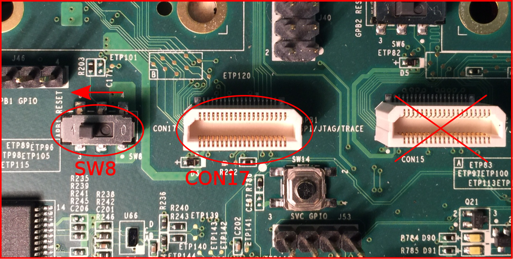

This page provides details on setting up your BDB and other hardware, to prepare for loading and debugging firmware images.

The development hardware has exposed components and connectors, and is extremely ESD-sensitive. Ensure your work area is ESD-safe by using a grounded static-dissipative mat or work surface, and wearing a grounded wrist strap at all times. Do not handle boards any more than necessary, and always handle by the edges. Avoid touching components or pins.

Your BDB shipment should contain the following.

Qty | Item | Description
----|------|-------------
1 | B6A DA0B6ATH8C0 | Big development board
1 | ADUS01 | 12VDC power supply for BDB
2 | DAB6ATH96B0 | Debug adapter board
2 | B6A-DEBUG_FPC | FPC cable for debug adapter
1 | DA0B6APB4A0 | Jetson adapter board
1 | IJZ-IR | FPC cable for Jetson adapter
1 | Jetson TK1 AP Devkit | Includes PSU, USB cable, etc

In addition, the following items are also required.
Qty | Item | Description
----|------|-------------
2   | [J-Link Pro](http://www.segger.com/jlink-pro.html) |
3   | cable | USB A to micro B cable
 
[Hi-rez annotated picture of BDB](images/BDB1B-Board.png)
[Hi-rez annotated picture of Accessories](images/BDB1B-Accessories.png)

Verify the Debug Adapter Boards are configured for JTAG use. 
1. JP15 header pins 1-2 has a jumper installed. JP15 is located between CON2 (CPU) and CON3 (Bridge). This provides power to the JTAG interface. Pin 1 is denoted by a round solid dot on the board.
2. SW5 (RST_40uS) is positioned *away* from the SW5 label on the silkscreen. This allows the ARM processor in the bridge chip to run. If SW5 is in the other position, the processor is held in reset and JTAG debugging is not possible.

We'll begin with at a bird's-eye view of the BDB setup, for orientation and reference.  Please, however, follow the step-by-step instructions that follow, and **wait to apply power to the BDB1B until instructed**:

Before applying power, you'll want to cable everything together:
* Attach the micro USB end of a USB cable to the connector on the BDB1B labeled CON 28 (USB to APB1 HSIC).  Leave the other end of this cable unconnected, until instructed to attach it to your AP:

* Attach one end of a Debug FPC cable (the end labeled **BDB**) to the BDB1B connector labeled CON17 (APB1 SPI/JTAG/TRACE) and the other end (labeled Debug Board) to the mating connector on one of the Debug Adapter Boards:

Please double-check that you're connecting to CON17, not to CON15, which is in the same neighborhood.  Please also verify that SW8 (APB1 RESET) on the BDB1B is in the position shown, so that APBridge 1 will be operational later on.
* Attach one end of a Debug FPC cable (the end labeled **BDB**) to the BDB1B connector labeled CON19 (APB2 SPI/JTAG/TRACE) and the other end (labeled Debug Board) to the mating connector on the other Debug Adapter Board:

Please verify that SW9 (APB2 RESET) on the BDB1B is in the position shown, so that APBridge 2 will be operational later on.
* Attach the micro USB end of a USB cable to the connector labeled CON6 (UART) on each Debug Adapter Board.  These cables will provide access to the consoles for APBridge 1 and APBridge 2:

* Connect a JTAG debugger to the 20-pin connector labeled CON3 (Bridge) on the each Debug Adapter Board. **Note**: Please visually verify that you are plugging into CON3, not CON2. CON3 is shown in the image above, with a ribbon cable attached, and the CON3 label is also printed on the Debug Adapter Board itself.
* Connect each JTAG debugger to the build machine via a direct USB connection.  The J-Link Pro JTAG Debugger also supports connections via Ethernet, but the present document assumes USB.

If the 2 USB console cables are connected to a PC, the APBridge 1 and APBridge 2 consoles may be accessed (when code is running) via a terminal emulator such as minicom: 115200, 8N1, no hardware flow control.

You may apply power at this point by attaching the provided 12V DC power source to CON27 (DC Jack 12V) on the BDB1B:

As a result of following the procedure detailed above, your setup should now match the bird's eye view that first appeared towards the top of the present page:

#### Next Steps

The next step in bringing up your development board is to finish the [Development Machine Setup](Development-Machine-Setup).

After that, you can proceed to the [Firmware Build](Firmware-Build).